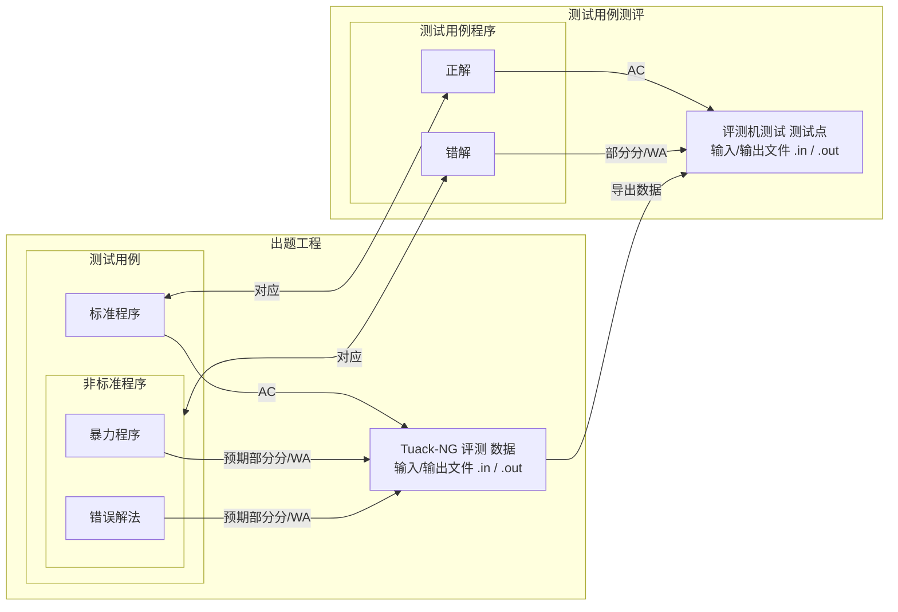

# 数据与测试用例

> Tuack-NG 中测试用例、数据与标准程序的基本概念。

## 测试用例

测试用例是用于解决这道题的一系列程序，其中可能包括暴力程序、不应通过的错误解法和标准程序。

你可以配置每个测试用例的预期分数，Tuack-NG 会在没有达到预期时发出警告。详见 [测试配置](../../test/config)。

## 数据

数据是用于测试测试用例（在开发时）与测试用例代码（在评测时）的输入/输出文件。

Tuack-NG 主要注重前者，后者使用 `dump` 命令交给评测机完成。详见 [数据点配置](./configure)。

## 标准程序

标准程序是测试用例中正确、标准且应当通过所有数据的代码。

## 关系图

