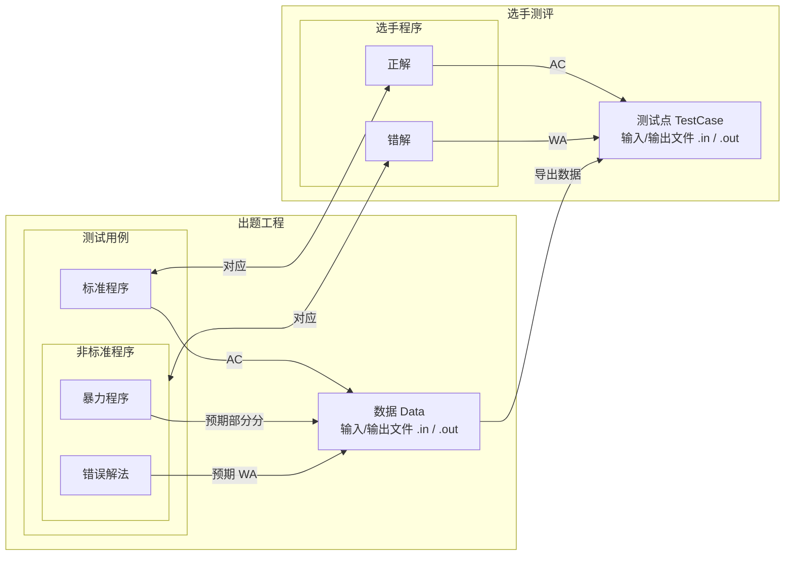

# 测试用例，数据与标准程序

## 概念

我们首先要明确这三个概念。

### 测试用例

测试用例是用于解决这道题的一系列程序，它们不一定都是正确解法，其中可能包括暴力，不应通过的错误解法和标准程序。

你可以配置每个测试用例的预期，Tuack-NG 会在没有达到预期时发出警告。

### 数据

数据是用于测试测试用例（在开发时）与选手代码（在评测时）的输入 / 输出。

Tuack-NG 主要注重前者，后者使用 `dump` 命令交给评测机 / OJ 完成。

### 标准程序

标准程序是测试用例中正确、标准且应当通过所有数据的代码。

### 关系图

